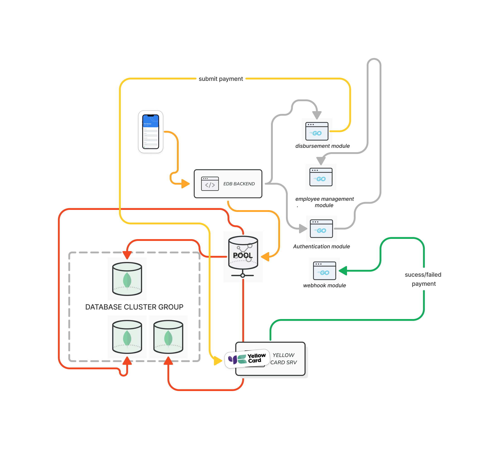
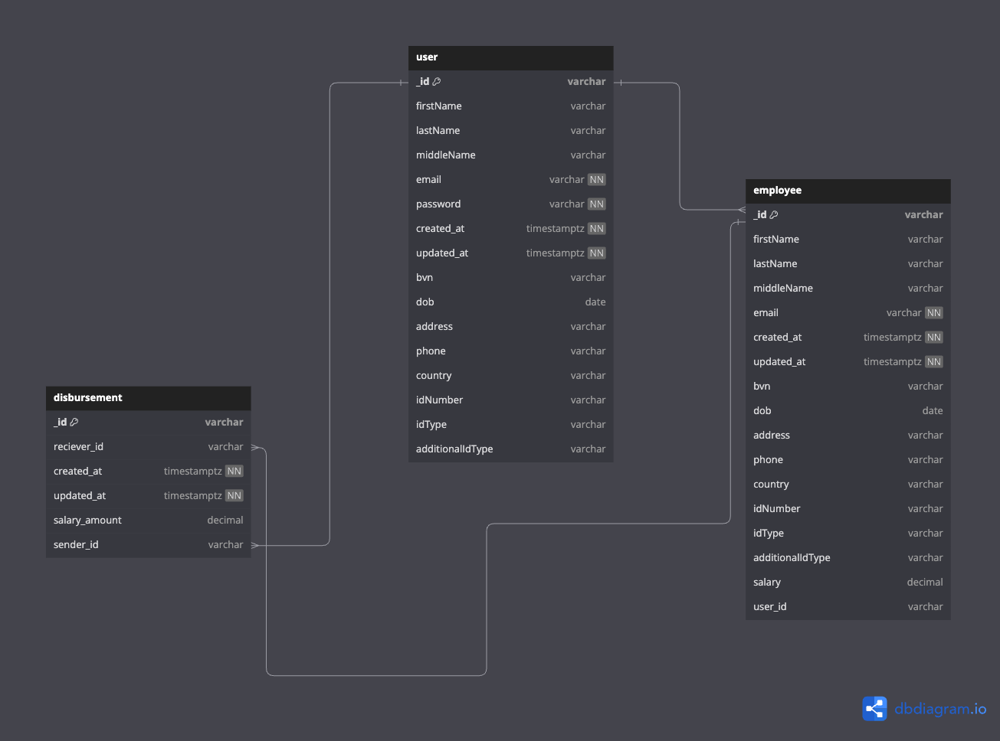

# EDB Application
A simple employee salary disbursement backend application. A widespread problem for all large to small range businesses is how employees' salaries are released at the due date via the HR team. A good solution to this is having an application that allows business owners to have the registered account information of their employees and easily make payments to all the registered employees in the business.

While this is a simple solution and can be evolved into a full-fledged application,  The design of this system is focused on integrating with the Yellow Card Payment API for salary disbursement.

## Requirements
Business can 
-   Manage the employees.
-   Add employees to application.
-   Update and delete the employee's details
-   Make payment to the employee's account
-   View the payment status

## Assumptions
-  All  payment  are assumed to be in Naira alone.
-  Refunds and cancellations are not supported.
-  Account has been funded already via the YellowCard dashboard 
-  The user is the business owner
-  Provided information have been validated.
-  KYC meta information for employees and employers have been collected and verified.

## Question & Concerns
-   What does yellow card support this kind of system ?
-   Is there a postman support ?
-   What is the flow :
	-  to create an account ?
	-  does  yellow card just  facilitate payment between two account ?
	-  what channel do yellow card support ? - https://docs.yellowcard.engineering/docs/channels-api
-  How do I perform authentication with YC?
	- Header must include `X-YC-Timestamp` & YchmacV1 `Authorization`  - https://docs.yellowcard.engineering/docs/authentication-api
-  Environments  -  https://docs.yellowcard.engineering/docs/environments-api

## Challenges
- Understanding the authentication section proved a bit dificult as I was getting  `invalid apiKey signature combination` even with the provide recipe in https://docs.yellowcard.engineering/recipes/authentication-javascript-python.

- Creating webhook was a bit stressful since I had to work with the POST,GET, DELETE endpoint during development to actually create them

- Also understanding what yellow card was built around and how payment that were submitted were processed. This was due to me having no initially knowledge of ramp payment.

- Got some errors when I provided custom payment reason during payment  submission.

### Useful YC Links
-  https://docs.yellowcard.engineering/recipes
-  https://docs.yellowcard.engineering/docs/making-a-disbursement-with-the-modal 
-  https://docs.yellowcard.engineering/docs/webhooks-api
-  https://docs.yellowcard.engineering/docs/events-api
	

## Design

## Models & Relation

## Video Link
- https://drive.google.com/file/d/10XYCOlc-lTCxZ3fh89P5o6WE71JTiFc1/view?usp=sharing